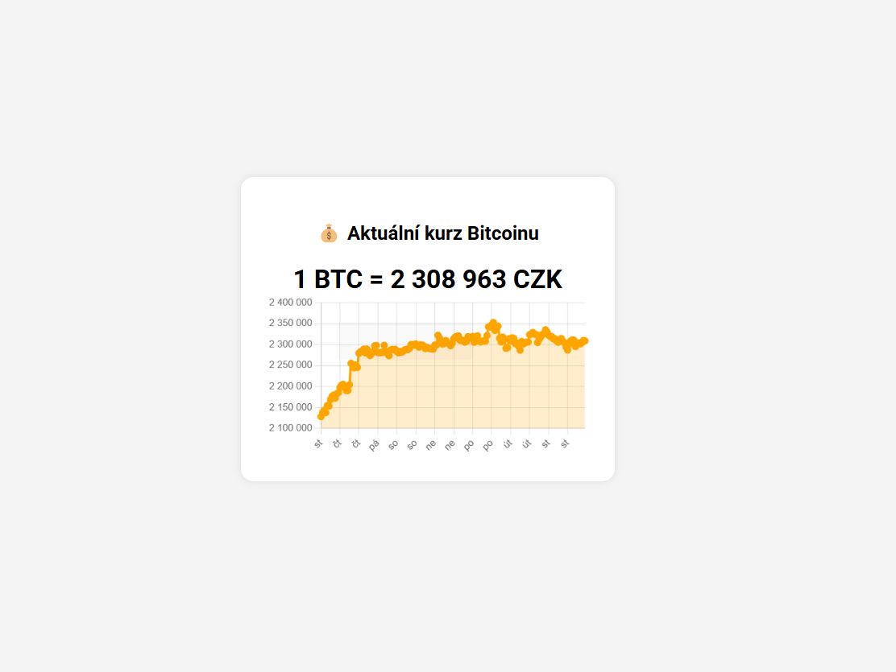

# ₿ Kurz Bitcoinu (CZK)

Jednoduchá webová aplikace, která zobrazuje aktuální kurz Bitcoinu v českých korunách a graf vývoje ceny za posledních 7 dní. Data jsou načítána z veřejného API [CoinGecko](https://www.coingecko.com/).

## ✨ Funkce

- ✅ Aktuální kurz 1 BTC v CZK
- 📈 Graf vývoje za posledních 7 dní (line chart)
- ⏳ Automatické načtení při otevření stránky
- 📱 Responzivní design (funguje i na mobilu)
- 💡 Ikona Bitcoinu v záložce prohlížeče (favicon)
- 🎨 Jednoduchý a přehledný vzhled (Roboto font, bílý box, stín)

## 🌐 Online verze

Aplikaci si můžeš vyzkoušet zde:  
➡️ [https://tvojeuživatelskejmeno.github.io/nazev-repozitare]([https://tvojeuživatelskejmeno.github.io/nazev-repozitare](https://hanacektomas.github.io/crypto_api)

_(nahraď podle potřeby)_

## 📸 Náhled

## 🔧 Použité technologie

- HTML, CSS, JavaScript
- Chart.js – knihovna pro vykreslování grafu
- CoinGecko API – pro aktuální kurz a historická data
- Google Fonts – písmo Roboto
- GitHub Pages – pro hostování

## 🗂️ Struktura souborů

